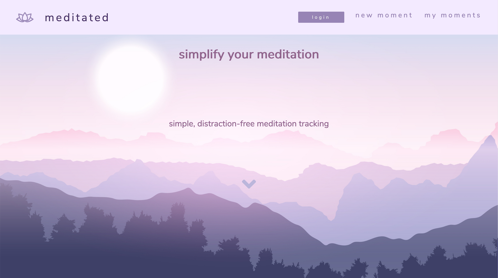
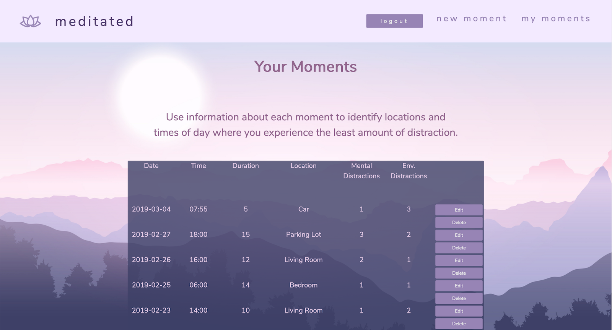

# Meditated

## Overview

**Meditated** is an app that allows the user to record their meditation sessions or mindful moments, and then review them in their dashboard. This provides data for the user to review in order to determine the best parameters for optimal mindfulness.

[Live App](https://meditated-client.herokuapp.com/)

**Demo Username:** demouser

**Demo Password:** password10

[Server Code](https://github.com/DavidDoes/meditated-api)

[API Documentation](https://documenter.getpostman.com/view/1740901/S17kyr3n)

## Technologies

- [HTML5](https://developer.mozilla.org/en-US/docs/Web/Guide/HTML/HTML5)
- [CSS](https://developer.mozilla.org/en-US/docs/Web/CSS/Reference)
- [JavaScript ES6](https://developer.mozilla.org/en-US/docs/Web/JavaScript)
- [ReactJS](https://reactjs.org/)
- [Redux](https://redux.js.org/)
- [Node.js](https://nodejs.org/en/)
- [Express.js](http://expressjs.com)
- [JSON Web Token](https://jwt.io/)
- [Passport.js](http://www.passportjs.org/)
- [MongoDB](https://www.mongodb.com/)
- [Mongoose](https://mongoosejs.com)
- [Heroku](https://heroku.com)

## Screenshots

## Future Implementations

**Mood Check-in & Reactive Theme**

- Upon login, user is prompted to choose the sort of mood they are experiencing.
- Once chosen, the app color theme will change to colors that promote positive feelings that combat that mood.

**Graphs**

- Use data collected from user's Moments to create graphs, giving the user a visual representation.

**Meditation Timer**

- User is able to select length of timer with notification at end, or select a stop-watch style timer that they end manually.
- User puts in their location and _Mental_ and _Environmental_ distractions.
- Time and date are auto-filled.
- User's mood is filled from previous prompt.
- A Moment is created at the end, rather than user filling in the form.

## Changelog

- _Aug 11, 2019_ - Add <select> to `updateMoment` component for `time` and `location`.
- _Aug 6, 2019_ - Error alerts for forms
- _Jul 15, 2019_ - Add <select> for choosing pre-existing location instead of creating new one every time.
